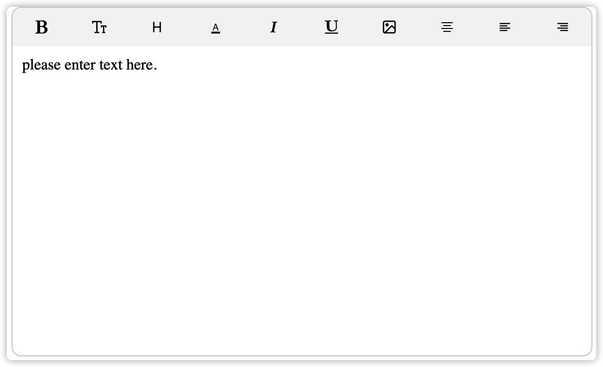

# What is it?

# Notice

a simple editor, just for study, not recommend for your project.

# Installion

```
npm install -S simple-editor
```

# Quick Start

```
import Vue from 'vue'
import Editor from 'simple-editor'

Vue.use(Editor)
```

